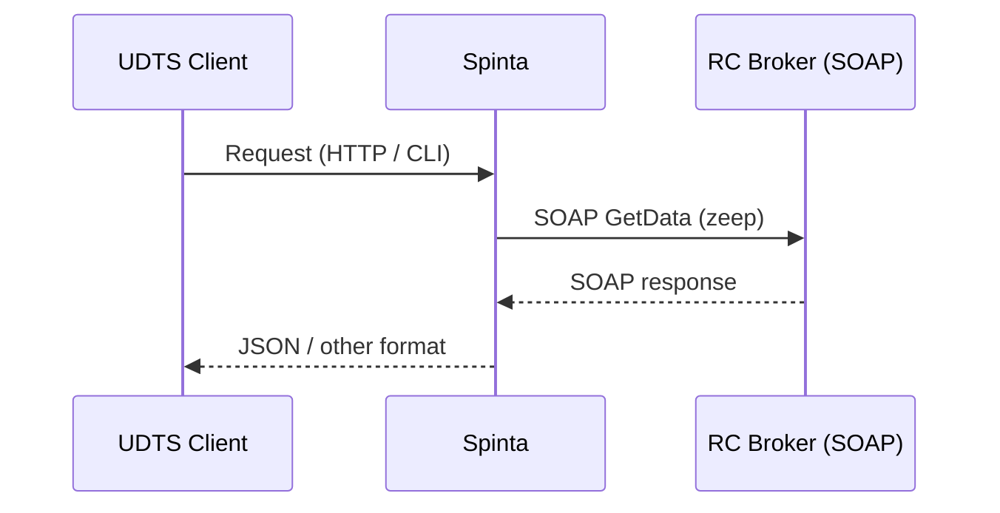
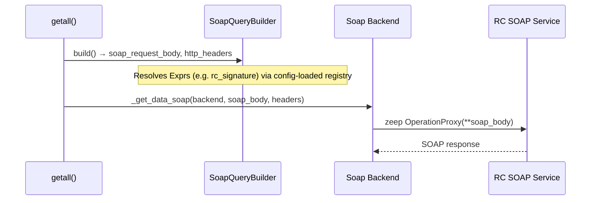

## Spinta RC Broker SOAP Signature Adapter – Analysis & Design

### 1. Purpose & Scope

This document describes how to extend Spinta to support **cryptographically signed RC “brokeris” SOAP calls** via a **pluggable adapter mechanism** and a **separate RC‑specific adapter repository**.


**Goals:**

- **Define where** in Spinta’s SOAP workflow we can plug in custom logic.
- **Define a generic adapter contract** that other projects can reuse.
- **Outline a separate RC broker adapter** that implements `Signature = F(key, arguments)`.
- **Provide enough detail** so that any developer can continue the work.

**Working POC:** A proof-of-concept implementation exists in this repository (signature generation, logging of SOAP envelope). See **§2.5 Current POC implementation** for locations, config, evidence, and limitations so you can build on it instead of re-implementing.

### 1.1 Assumptions

The following assumptions underpin this analysis and the POC. If any of them change, the design or estimates may need to be revisited.

- **Central Agent / single key pair**
  - The **Signature is generated on the RC Broker Spinta Agent** (the central Agent that talks SOAP to RC, e.g. at VSSA). Only that Agent holds the private key and signs requests. We therefore need **only one key pair** for that Agent; Caller IS systems do not sign RC requests and do not need RC keys. (See “Who generates the RC signature” in §2.2.)

- **Signature mechanism matches the provided documentation**
  - The signature algorithm, string-to-sign order, and encoding rules are **exactly as described** in the official RC contract and the **provided legacy example** (e.g. shell script with OpenSSL). We **cannot efficiently verify** correctness against a live RC test environment (no direct access; testing is done by VSSA staff on DEV). The given example and docs are therefore treated as **authoritative**; if they are inaccurate, we risk long back-and-forth cycles with the client. The POC and any separate adapter must implement the same order and algorithm as the legacy example and §2.2 / §3.4.

- **No direct RC test environment access**
  - The development team **does not have** RC test environment access (IP allowlist, keys). Code is pushed to **DEV** and **VSSA (client) employees** perform tests against RC and report results. This feedback loop can add to completion time and limits our ability to quickly validate signature behaviour. (See §7.3.)

- **POC scope (Mode 1 / 2, env-based key)**
  - The POC implements **Mode 1 and Mode 2** only; **CallerSignature** (Mode 3) is not computed. Key material is supplied via **config.yml** (`rc_signature.private_key_path`) or **environment variable** (`RC_POC_PRIVATE_KEY_PATH`); `creds()` integration is design for later.

- **Official RC contract and legacy example are the normative spec**
  - For string-to-sign order, field names, algorithm (RSASSA-PKCS1-v1_5 + SHA-256, Base64, strip `\r`/`\n`), and Time constraint, the **official RC document** and the **legacy SOAP call example** are the normative references. Unit tests and the adapter logic are aligned to those; no independent verification against RC is assumed during development.

---

## 2. Context & High‑Level Flow

### 2.1 Conceptual pipeline

UDTS / DSA manifests drive SOAP calls via Spinta’s SOAP backend. Inside Spinta: manifest and params are resolved, SoapQueryBuilder builds the SOAP body (including signature when using `rc_signature()`), and the backend uses zeep to call RC.



### 2.2 RC Broker overview

RC (Registrų centras) exposes integrations via **RC Broker** – a central SOAP/SOA gateway in front of many registry services. Key points:

- **Single gateway, many services**:
  - One common WSDL/endpoint.
  - Service catalog grouped by registry (e.g. NTR, JAR, etc.).
  - Actual business operation is selected by **`ActionType`** (service code) passed to a generic operation such as `GetData` / `GetDataRc`.
- **Payload schemas**:
  - Detailed request/response structures for each `ActionType` are defined by **XSD schemas**.
  - The broker’s generic SOAP operations accept an `input` structure whose fields (e.g. `ActionType`, `Parameters`, `EndUserInfo`, `CallerCode`, `Time`, `Signature`, `CallerSignature`) are constrained by these XSDs.
- **Authorization model (signatures)**:
  - Calls are made over HTTPS; network access can be restricted to whitelisted IPs.
  - **Request authenticity / integrity** is ensured by a **digital signature** computed from request argument values and a client private key.
  - RC verifies the signature using a previously shared public key / certificate.
  - The signature is sent as a **SOAP body field** (`Signature`, and optionally `CallerSignature`), not as an HTTP header.
  - Official description (incl. string-to-sign): [RC Broker duomenų teikimo sąlygos](https://www.registrucentras.lt/bylos/dokumentai/duomenys/Vieninga_sutartis/Duomenų%20teikimo%20naudojantis%20saityno%20paslauga%20RC_Broker%20sąlygos.docx) (docx).

**Official contract summary (from RC “Duomenų teikimo naudojantis saityno paslauga RC_BROKER sąlygos”):**

- **Protocol:** SOAP 1.1, UTF-8. Single method: **GetData**. REST variant exists (`[URL]/index.rest.php`, JSON params) but is out of scope for this adapter; we target the SOAP path only.
- **Endpoints:**
  - TEST: `https://wstest.registrucentras.lt/broker` (WSDL: `.../broker/index.php?wsdl`, service: `.../broker/index.php`).
  - PRODUCTION: `https://ws.registrucentras.lt/broker`.
- **Access:** HTTPS only; caller must use a **fixed external IP** registered in RC’s “Duomenų vartotojų sąrašas”.
- **Signature algorithm (contract):** RSASSA-PKCS1-v1_5 with SHA-256; result Base64-encoded. Client must provide the **public key / certificate (PEM)** to RC in advance for verification.
- **String-to-sign (contract):** The signed string is built from parameter values concatenated in **alphabetical order by parameter name**. Official pseudocode uses: `ActionType`, `CallerCode`, `EndUserInfo`, `Parameters`, `Time`. After signing, the Base64 string must have `\r` and `\n` removed. (If REST-style `Options` is used, it is included in the signed set and order changes; SOAP path does not use `Options`.)
- **Time constraint:** Parameter `Time` value must not be older than “current time minus 1 minute” (request time must be fresh).
- **WSDL InputParams (GetData):** `ActionType`, `Parameters`, `EndUserInfo`, `CallerCode`, `Time`, `Signature` (all xsd:string). Mode 3 may add `CallerSignature` in extended/other schemas; base WSDL shows these six.
- **Parameters:** XML with root `<args>`, structure per service (XSD per ActionType); service list and XSDs at `[URL]/info.php`.
- **EndUserInfo:** XML with root `<user>`; must contain either `<vv>` (RC username) or `<asm_kodas>` (personal code), plus contract info (e.g. `<vaidmuo>vasu</vaidmuo><id>…</id>`). Details and examples are in the official doc.
- **CallerCode:** Fixed value – system user name assigned to the Gavėjas when the data provision contract was signed.
- **Response:** `ResponseCode` 1 = success, 0 = no data, -1 = error; `ResponseData` contains payload (e.g. base64).

**Who generates the RC signature (deployment assumption):**

This design assumes a **central Spinta Agent** deployed “on the RC Broker side” (e.g. at VSSA or in front of RC), not an Agent per data consumer (e.g. per Regitra). In that model:

- The **RC contract** (Gavėjas, CallerCode, fixed IP, public key registration) is held by the **operator of the central Agent**. Only that Agent talks SOAP to RC and must sign requests.
- The **Spinta Agent that calls RC Broker** holds the **private key**, generates the key pair (or receives it from ops), registers the **public** key with RC, and **adds the legacy `Signature`** (and optionally `CallerSignature` in Mode 3) to every outgoing GetData SOAP request. So **the Agent generates the initial signature**; no other system does.
- **Caller IS** systems (e.g. Regitra viešoji įmonė, municipalities) do **not** implement RC signing. They call the Agent over **UDTS/REST** and are authenticated via the **central Spinta Authorization service**. For them, RC signature generation is redundant and hidden behind the Agent.
- Alternative deployment: one Spinta Agent per Caller IS, each with its own RC contract and key pair; then that Agent would generate the signature for that IS. This document and the POC target the **central Agent** deployment.

RC Broker documentation describes **three working modes** (simplified):

- **Mode 1 – Standard IS → RC**

  `Signature = Sign(ActionType + CallerCode + Parameters + Time)`

- **Mode 2 – End user via caller IS**

  `Signature = Sign(ActionType + CallerCode + EndUserInfo + Parameters + Time)`

- **Mode 3 – IS → IS via caller IS**

  - End system signature:

    `Signature = Sign(ActionType + CallerCode + EndUserInfo + Parameters + Time)`

  - Caller system signature:

    `CallerSignature = Sign(ActionType + CallerCode + EndUserInfo + Parameters + Signature + Time)`

Here “+” denotes **string concatenation** of parameter values in the exact order given, and `Sign` is RSA (RSASSA‑PKCS1‑v1_5) with SHA‑256 over the concatenated string, Base64‑encoded. In practice, implementers iterate the relevant parameter names in the documented order, concatenate their values, sign, and Base64‑encode the result.

### 2.3 Relevant code

SOAP request flow: `getall` (in `spinta/datasets/backends/dataframe/backends/soap/commands/read.py`) uses **SoapQueryBuilder** to build `soap_request_body`, then `_get_data_soap(..., soap_request_body, extra_headers)`; the WSDL/zeep client comes from `spinta/datasets/backends/wsdl/components.py` and `.../dataframe/backends/soap/components.py`. Body construction from manifest params lives in `.../soap/ufuncs/ufuncs.py`. For **where the RC signature POC and adapter plug in**, see **§2.6**.

---

### 2.4 End‑to‑end Spinta SOAP backend flow

The RC signature adapter plugs into the SOAP body build:

- The signature is produced **inside** the SOAP body build: the `Signature` param has **prepare `rc_signature()`**, so when the body is built and populated (`_populate_soap_request_body_with_url_values`), that expression is resolved and the adapter logic runs. The command does not need a second step (e.g. “build body, then call adapters”); one pass builds the body and resolves the signature in the same flow.
- DSA‑based transformations (e.g. base64 decode, XML parse → `Country` model) stay in the standard dataframe + ResultBuilder path (after `_get_data_soap` → Dask → `dask_get_all` → ResultBuilder).

### 2.5 Least intrusive approach and adapter mechanism

**Why this is the least intrusive approach**

The POC does not add a separate adapter step in the SOAP command. Instead, the signature is **just another prepared value** from DSA’s point of view: the manifest declares a param that maps to `input/Signature` with **prepare `rc_signature()`**. When the SOAP body is built, the existing pipeline resolves that prepare expression like any other (e.g. `input()`, `creds(...)`). Resolving `rc_signature()` runs the adapter logic and returns the signature string.

**What was added**

| Area | Change | Intrusion |
|------|--------|-----------|
| **Manifest / DSA** | New prepare `rc_signature()` in param’s prepare column. | Declarative only. |
| **Adapter registration** | `spinta/adapters/soap_plugins.py`: loads adapters from config-driven modules (`soap_adapter_modules` in `config.yml`). `register_soap_ufuncs(registry, raw_config)` is called from config load. Generic resolvers for (LoadBuilder, Expr) and (SoapQueryBuilder, Expr) dispatch by name. | One module; config load calls it once. |
| **LoadBuilder** | No hardcoded `rc_signature`; deferred prepare names come from the config-loaded adapter modules. Generic resolver stores `Expr` in `param.soap_body` for any registered name. | Generic; no adapter names in core. |
| **SoapQueryBuilder** | No hardcoded `rc_signature`; body resolvers come from the config-loaded adapter modules. Generic resolver looks up `expr.name` in registry; `_finalize` skips any Expr whose name is in deferred set. | Generic; no adapter names in core. |
| **Adapters** (`spinta/adapters/rc_signature_adapter.py`) | `compute_rc_signature_from_body(soap_body, context)`, key from `rc_signature.private_key_path` (config.yml) or `RC_POC_PRIVATE_KEY_PATH` (env var); `get_deferred_prepare_names()` and `get_body_resolvers()` are exported by the module and loaded via `soap_adapter_modules`. | Isolated module; can be shipped as a drop‑in file. |
| **SOAP command** | NA → `""` in `_get_data_soap`; envelope logging for POC. | No change to getall flow. |

The SOAP backend stays **generic**: it builds the body from the manifest and resolves prepare expressions. It does not need to know about “RC” or “adapters”.

**How the adapter mechanism works**

- **“Adapter”** = the logic that computes the RC signature (string-to-sign, key, algorithm). In the POC it lives in `spinta/adapters/rc_signature_adapter.py` (`compute_rc_signature_from_body`).
- **“Mechanism”** = **DSA prepare** plus **config-driven adapter loading**. The manifest says “the value of `Signature` param is `rc_signature()`”. At config load, `register_soap_ufuncs()` loads adapter modules listed under `soap_adapter_modules` and registers their deferred prepare names and body resolvers. When the body is built, the generic (LoadBuilder, Expr) resolver stores the `Expr` in `param.soap_body`; the generic (SoapQueryBuilder, Expr) resolver looks up the name and calls the adapter’s callable.

**Why an adapter repo (or isolated adapter) helps**

- **Spinta core stays generic:** No RC-specific code in core; only “resolve this prepare expression”. The RC-specific piece is the signing helper, which can live in `spinta/adapters/rc_signature_adapter.py` or a separate package.
- **Only the RC-facing instance needs it:** The Spinta runner in front of RC Broker (e.g. run by RC/VSSA) must sign requests. Only that instance installs the adapter, configures the key, and uses `rc_signature()` in the manifest.
- **Other instances unchanged:** Other Spinta instances (e.g. at a Caller IS) do not install the RC adapter, do not set the key, and do not use `rc_signature()`. Nothing changes for them.

**Short answer**

**Yes:** `rc_signature` is only used in the **one (or few) Spinta runner(s)** that call RC Broker and must sign requests—typically the **central Agent run by RC/VSSA**. All other Spinta instances use the same codebase but do not use this prepare and do not need the adapter or the private key.

### 2.6 Current POC implementation

A **working POC** is in this repository. Signature is produced via **DSA prepare `rc_signature()`**, with the adapter module loaded via Spinta’s SOAP adapter mechanism. Use it as the reference when continuing work.

**Where it lives**

- **Adapter registration:** `spinta/adapters/soap_plugins.py`
  - Loads adapters from config: `soap_adapter_modules` list in `config.yml` (local files; no package install).
  - `register_soap_ufuncs(registry, rc)` is called from config load (`spinta/types/config.py`); it registers generic (LoadBuilder, Expr) and (SoapQueryBuilder, Expr) resolvers for each name provided by adapters.
  - `get_deferred_prepare_names()` returns the cached set used in `_finalize` to skip deferred Exprs until `_populate`.
- **Adapter logic:** `spinta/adapters/rc_signature_adapter.py`
  - `build_rc_poc_string_to_sign(soap_body)` – builds the canonical RC string‑to‑sign from `ActionType`, `CallerCode`, `EndUserInfo`, `Parameters`, and `Time`.
  - `compute_rc_signature_from_body(soap_body)` – uses the string‑to‑sign and OpenSSL to compute the Base64 signature (or returns `None` on failure).
  - `get_deferred_prepare_names()` and `get_body_resolvers()` – exported by the module and loaded either via entry points or `soap_adapter_modules`; in this demo they are loaded from `soap_adapter_modules` configured in `config.yml`.
- **DSA / ufuncs:** Manifest param `signature` has **prepare `rc_signature()`**. No hardcoded `rc_signature` in LoadBuilder or SoapQueryBuilder; both use the generic resolvers registered from the adapter registry. The RC adapter supplies `"rc_signature"` in both lists and the callable that runs `compute_rc_signature_from_body(env.soap_request_body)`.
- **SOAP command:** `spinta/datasets/backends/dataframe/backends/soap/commands/read.py`
  - `_get_data_soap` normalises NA to `""`, resolves any `MakeCDATA` wrappers to CDATA, and logs payload and envelope fragment (`_log_soap_envelope_fragment`) for POC debugging.

**Configuration**

- Private key path (in priority order):
  1. **config.yml**: `rc_signature.private_key_path`
  2. **environment variable**: `RC_POC_PRIVATE_KEY_PATH`
  
  If neither is set, the adapter returns `None` and the signature is empty.
- Local testing (no RC call):
  - Set `RC_POC_MOCK_SOAP=1` to skip the real SOAP call (Spinta will still build/log the SOAP payload and compute `Signature`).
- Adapter module:
  - In this POC, the RC adapter is loaded from a local file via `soap_adapter_modules` in `config.yml` (see `demo.md`).

**Evidence it works**

- At WARNING level, logs show the SOAP request payload and an envelope fragment with `<apps:Signature>` populated (when the key is set).
- Demo: `dsa.csv` (signature param has `rc_signature()`), `demo.md` for run steps and key configuration.

**POC limitations (reduce workload by not re-implementing these)**

- Key only from env; no `config.yml` or `creds()`.
- Single adapter only; no adapter list from config/manifest.
- No `creds` argument passed to the adapter.
- Mode 1/2 only; `CallerSignature` is not computed.
- Signature and full payload are logged (do not use in production; avoid logging secrets).
- Error handling: on signing failure the adapter logs and returns unmodified `soap_body` (no Spinta exception).

**Reference for correctness**

- The RC legacy bash formula and the mode formulas in §2.2 / §3.4 are the normative spec; the POC implements the same string-to-sign order and algorithm. Keep those snippets for tests and the future separate adapter package.

## 3. Requirements

### 3.1 Problem statement – why an adapter is needed

The Spinta‑based Agent modernizes RC Broker SOAP/SOA services by exposing them as **REST/UDTS endpoints**. However, RC Broker’s authorization model requires a **`Signature` (and sometimes `CallerSignature`) computed from specific SOAP parameter values** using the client’s private key.

When the Agent:

- Translates SOAP payloads into REST/UDTS,
- Renames or restructures fields,
- Potentially changes ordering or even the set of parameters,

the Agent **no longer has a canonical RC Broker payload** with the exact values and ordering required by RC to build the “string to sign”. As a result:

- The Agent **cannot reliably produce a valid RC Broker signature** purely from the REST/UDTS view, unless:
  - It retains a clear internal notion of the RC Broker canonical inputs (`ActionType`, `CallerCode`, `EndUserInfo`, `Parameters`, `Time`, etc.), and
  - It knows the exact **signature mode** and concatenation rules.
- Asking REST clients to manually supply RC‑specific signature inputs (or signatures themselves) would **break the abstraction** and defeat the purpose of the modernization layer.

Therefore, we need a **dedicated RC Broker Signature Adapter** that runs on the **Spinta Agent that calls RC Broker** (see “Who generates the RC signature” in §2.2). That adapter:

- Understands RC’s signing rules (modes, fields, ordering, algorithm).
- Maps from the modern REST/UDTS request into the **canonical RC Broker inputs**.
- Computes `Signature` (and `CallerSignature` when needed) server‑side using the Agent’s private key.
- Injects these into the SOAP request before it is sent. Caller IS systems do not hold RC keys or generate RC signatures; they use UDTS and central Spinta Authorization only.

### 3.2 Generic adapter mechanism

- **R1**: Spinta must support **custom logic adapters** that can be registered and invoked in the SOAP flow, not just for RC.
- **R2**: Adapters must be able to:
  - Inspect **UDTS/DSA‑derived parameters** and **final SOAP payload** (body and headers).
  - **Modify** the outgoing SOAP request (body and/or headers).

### 3.3 RC broker–specific behavior

- **R3**: Implement a **RC broker adapter** that computes:

  $$\text{Signature} = F(\text{key}, \text{arguments})$$

  where:
  - `key` – asymmetric private key (from configuration/creds).
  - `arguments` – canonical string per RC mode (e.g. ActionType + CallerCode + … + Time).

- **R4**: Place the generated signature in the **SOAP body** as required by RC (`Signature`; for Mode 3 also `CallerSignature`). RC does not use HTTP headers for this.
- **R5**: Validate against **RC test environment**.

### 3.4 RC legacy example – concrete formula

The RC “legacy SOAP call” shell script clarifies the exact shape of the function:

```bash
CALLER="TEST_IS,vasu_id=000000"
USER_INFO=""
PRIVATE_KEY_FILE=raktas_priv.pem

ACTION=17
PARAMS=$(cat <<EOF | tr -d '\n'
<?xml version="1.0" encoding="UTF-8" standalone="yes"?>
<args>
  <obj_kodas>188772433</obj_kodas>
  <nuasmenintas>1</nuasmenintas>
  <fmt>xml</fmt>
</args>
EOF
)

TIME=$(date +"%Y-%m-%d %H:%M:%S")
ARGS="$ACTION$CALLER$USER_INFO$PARAMS$TIME"
SIGNATURE=$(echo -n "$ARGS" | openssl dgst -sha256 -sign $PRIVATE_KEY_FILE | base64 -w0)
```

From this we derive:

- Arguments are concatenated in this exact order (no separators):

  $$\text{ARGS} = \text{ACTION} + \text{CALLER} + \text{USER\_INFO} + \text{PARAMS} + \text{TIME}$$

  - `ACTION`      → SOAP body `input/ActionType`
  - `CALLER`      → SOAP body `input/CallerCode`
  - `USER_INFO`   → SOAP body `input/EndUserInfo`
  - `PARAMS`      → XML payload placed into `input/Parameters` as CDATA (with newlines removed by `tr -d '\n'`)
  - `TIME`        → SOAP body `input/Time` in format `YYYY-MM-DD HH:MM:SS`

- The signature algorithm is:

  $$\text{Signature} = \text{Base64}(\text{Sign\_SHA256}(\text{ARGS}, \text{private\_key}))$$

  where `Sign_SHA256` is an RSA (or similar) private‑key signing operation with SHA‑256 over the raw bytes of `ARGS`.

**Alignment with official contract:** The order in the legacy example (ActionType, CallerCode, EndUserInfo, Parameters, Time) matches the **alphabetical order by parameter name** required by the official RC document. The adapter must use this same order. After Base64-encoding the signature, any `\r` and `\n` characters in the encoded string must be removed before sending (as in the official pseudocode).

The SOAP envelope in the example confirms that these values are used as:

```xml
<reg:GetData soapenv:encodingStyle="http://schemas.xmlsoap.org/soap/encoding/">
  <input xsi:type="reg:InputParams" xmlns:reg="http://www.registrucentras.lt">
    <ActionType xsi:type="xsd:string">$ACTION</ActionType>
    <Parameters xsi:type="xsd:string"><![CDATA[$PARAMS]]></Parameters>
    <EndUserInfo xsi:type="xsd:string">$USER_INFO</EndUserInfo>
    <CallerCode xsi:type="xsd:string">$CALLER</CallerCode>
    <Time xsi:type="xsd:string">$TIME</Time>
    <Signature xsi:type="xsd:string">$SIGNATURE</Signature>
  </input>
</reg:GetData>
```

This concrete formula will be used as the basis for:

- Unit tests in the RC adapter repo (compute signature in Python and compare to known values).
- Mapping from UDTS/DSA parameters to the `ActionType`, `CallerCode`, `EndUserInfo`, `Parameters`, `Time`, and `Signature` SOAP fields.

### 3.5 Operational requirements

- **R6**: The RC adapter is delivered as a **drop‑in Python file** loaded via `soap_adapter_modules` in `config.yml`.
- **R7**: Documentation:
  - How to define and use **drop‑in SOAP adapters** in Spinta.
  - How to configure and use the **RC broker signature adapter**.

---

## 4. Adapter Integration in SOAP Flow

**Status:** Adapters are invoked **during** SOAP body build via config‑registered resolvers (§2.5, §2.6). The following describes the implemented approach.

### 4.1 Implemented approach: prepare resolution

Signature (and any adapter-supplied value) is a **prepared value** in the manifest. When SoapQueryBuilder builds `soap_request_body`, it resolves prepare expressions; deferred names (e.g. `rc_signature`) are resolved by calling the adapter’s body resolver from the config‑loaded registry. So the “adapter” runs **inside** the build step, not after it.



No separate “AdapterManager” or post-build step; adapter logic is invoked when the builder resolves a deferred Expr.

### 4.2 Adapter responsibilities (current implementation)

In the POC, an adapter contributes **resolvers** (loaded from `soap_adapter_modules`): a body resolver is called when the builder resolves an `Expr` whose name is in the adapter’s body-resolver map; it receives `(env, expr)` (env is the SoapQueryBuilder, with `soap_request_body`, etc.) and returns the value to inject (e.g. the signature string). Optionally it can register deferred-prepare names so the value is computed at prepare time. The adapter does **not** receive or return full `soap_body` / `http_headers`; it only supplies values for specific Exprs during body build.

---

## 5. Adapter Contract & Configuration

**Status:** Adapters are loaded via **config-driven module loading** (drop‑in local files). This allows deploying adapters without updating Spinta's version.

### 5.1 Current contract: body resolvers

Adapters provide two functions:
- `get_deferred_prepare_names() -> list[str]` – names to defer until body build
- `get_body_resolvers() -> dict[str, callable]` – name → resolver function

A body resolver is a callable `(env, expr) -> value` where `env` is the SoapQueryBuilder (with `soap_request_body`, etc.) and the return value is injected for that Expr. Spinta does not depend on a specific implementation; it only calls whatever is registered for each name.

### 5.2 Adapter loading

**Config-driven module loading (drop‑in local files)**

Adapters can be loaded from local Python files without package install. In `config.yml`:
```yaml
soap_adapter_modules:
  - /opt/spinta/adapters/rc_signature_adapter.py
  - /opt/spinta/adapters/another_adapter.py
```

Each module should have `get_deferred_prepare_names()` and/or `get_body_resolvers()` functions. Spinta loads these modules at startup.

**Benefits of config-driven loading:**
- No Spinta version update needed to add/change adapters
- Config change + restart is all that's required
- Local files work – admins can drop `.py` files and configure them
- No package install (`pip install`) needed

### 5.3 RC signature configuration

Key path can be set via `rc_signature.private_key_path` in config.yml or env var `RC_POC_PRIVATE_KEY_PATH`.

### 5.4 Error handling

- If an adapter fails:
  - Log the error with dataset/resource/model identifiers.
  - Fail the request with a clear Spinta error (preferred for signing issues).
- Avoid logging secrets; log only minimal contextual data.

---

## 6. RC Broker Signature Adapter (Delivery)

**Status:** Implemented in this repository as a drop‑in adapter file.

- Adapter file: `spinta/adapters/rc_signature_adapter.py`
- Loading: `soap_adapter_modules` in `config.yml`
- Enable in manifest/DSA: signature param has prepare `rc_signature()`

---

## 7. Implementation Work Breakdown (Overview)

### 7.1 Spinta core changes

- **A. Adapter infrastructure**
  - **Design for later:** Adapter protocol, global config mapping from adapter names to Python paths, manifest loading for per-resource adapters.
  - **Implemented:** **Config-driven adapter registration** (§2.5, §2.6): `soap_adapter_modules` allows deployments to drop in adapter files that register prepare names and body resolvers. Adapters plug in via DSA prepare and the generic resolvers. This satisfies “custom logic adapters that can be registered” (R1) for the SOAP prepare path.

- **B. SOAP flow**
  - Adapters are invoked **during** body build: when `read.py` builds `builder.soap_request_body`, config‑registered body resolvers run for deferred Exprs (e.g. `rc_signature()`). The result is passed directly to `_get_data_soap` (§4.1, §2.5).

- **C. Testing & docs**
  - Unit tests with a dummy adapter modifying headers/body.
  - Integration tests with manifest‑declared adapter.
  - `.md` documentation: “Generic Adapters in Spinta”.

### 7.2 RC broker adapter repo

- **D. RC adapter implementation**
  - Implement signature logic (string-to-sign, key loading, algorithm per RC’s “legacy SOAP call example”) in a drop‑in adapter file. Expose `get_deferred_prepare_names()` and `get_body_resolvers()` via the module exports; the body resolver receives `(env, expr)` and returns the signature string.

- **E. Testing & docs**
  - Unit tests verifying signature construction from known inputs.
  - No direct access to RC test environment; deployment and testing run via **DEV** with **VSSA (client) staff** performing tests and reporting back (working / issues). Iteration on their feedback may add time.
  - Docs:
    - “How to use Spinta RC broker Signature adapter”.

### 7.3 Rough effort estimates (indicative)

These estimates assume **one senior developer** familiar with Python and basic Spinta concepts. **There is no direct RC test environment access** (no IP allowlist/keys for the dev team); code is pushed to **DEV** and **VSSA employees** test against RC and report whether things work or what went wrong. That feedback loop can add to completion time.

- **Spinta core changes (7.1)**
  - Design & implementation of adapter infra, config-driven registration, manifest/config wiring: **2–3 workdays** (~16–24 h).
  - Unit & small integration tests, basic docs for generic adapters: **1 day** (~8 h).
  - **Total: ~3–4 days**.

- **RC adapter repo (7.2)**
  - Implement adapter, key‑loading abstraction, and tests against the legacy example: **2 days** (~16 h).
  - Deploy to DEV; VSSA staff test against RC and report results; stabilisation and iteration on feedback: **1–2+ days** (~8–16 h or more, depending on turnaround and number of iterations).
  - Docs (README + usage .md): **0.5–1 day** (~4–8 h).
  - **Total: ~3.5–5+ days**.

- **Overall envelope (analysis already done)**
  - Pure implementation + tests + docs: **~6.5–9 dev days** in total.
  - With code review, deployment to DEV, and the **client (VSSA) testing loop** (no direct RC access), plan for **~2–3 calendar weeks** from start of development to “ready for production testing”, with possible extra time for feedback iterations.

---

## 8. Open Questions / To Clarify

- **Key material – where and how is the private key managed? (VSSA / ops / RC)**
  - What is the **authoritative location** of the RC private key used for signing (e.g. file on disk, vault, HSM)?
  - How is it **provided to the Spinta Agent** (env var with path, mounted secret file, config entry)?

- **RC signature modes – which ones are required in phase 1? (VSSA / RC product owner)**
  - Do we need to support **Mode 1 and Mode 2 only**, or is **Mode 3 (CallerSignature)** also required for the first release?
  - If Mode 3 is needed, for which **services / ActionTypes** and on what timeline?
  - Can we treat Mode 3 as a **follow‑up iteration** if not immediately required?

- **Future multi‑tenant scenarios – confirm single central RC contract/key only (VSSA / architecture)**
  - Our design assumes a **single central Agent + single RC contract/key**; per‑caller RC contracts/keys are **not planned** and are considered **operationally impractical** (would require managing many public keys with RC, per‑caller key rotation, and tighter timing on the 1‑minute `Time` window).
  - Confirm with VSSA that this **centralised model is the only supported one** and that there is **no requirement** to support per‑caller RC contracts/keys in this project. If that ever changes, a separate design will be needed (and would likely have a different trust model than the current Spinta Auth).

---

## 9. References

- **RC Broker official contract (Lithuanian):** “Duomenų teikimo naudojantis saityno paslauga RC_BROKER sąlygos” – defines protocol (SOAP 1.1, GetData), endpoints (TEST/PROD), signature algorithm (RSASSA-PKCS1-v1_5 + SHA-256, Base64, strip `\r`/`\n`), string-to-sign (parameter values in alphabetical order by name), Time constraint, InputParams/WSDL, EndUserInfo/Parameters formats, and REST option. Link: [Registrų centras – RC_Broker sąlygos](https://www.registrucentras.lt/bylos/dokumentai/duomenys/Vieninga_sutartis/Duomenų%20teikimo%20naudojantis%20saityno%20paslauga%20RC_Broker%20sąlygos.docx) (DOCX).
- **Legacy SOAP call example:** Shell script demonstrating string-to-sign construction and OpenSSL signing (see meeting notes / Confluence “Signature legacy SOAP call example”). Used as the basis for adapter unit tests.
- **Spinta SOAP path:** `spinta/datasets/backends/dataframe/backends/soap/` and `spinta/datasets/backends/wsdl/` (see section 2.3).
